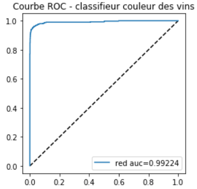
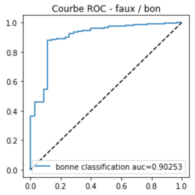

=======================
Devinettes et problèmes
=======================

Cette page regroupe quelques questions et problèmes
dont les solutions figurent dans les pages de ce site
intéressante du point de vue d'un data scientiste.

.. contents::
    :depth: 1
    :local:

Machine Learning
================

Ces exercices abordent des sujets liés au machine learning,
inventés pour des examens, un entretien d'embauche,
ou tirés de l'expérience d'un data-scientiste.

* `Comparer deux régressions <http://www.xavierdupre.fr/app/actuariat_python/helpsphinx/notebooks/enonce_2017.html#enonce2017rst>`_
* `Nearest Neighbours and Sparse Features <http://www.xavierdupre.fr/app/ensae_projects/helpsphinx/notebooks/nearest_neighbours_sparse_features.html>`_
* `Reconstruction de synonymes <http://www.xavierdupre.fr/app/actuariat_python/helpsphinx/notebooks/reconstruction_synonymes_enonce.html>`_

Mathématiques
=============

.. contents::
    :local:

Corrélations non linéaires
++++++++++++++++++++++++++

Le `coefficient de Pearson <https://en.wikipedia.org/wiki/Pearson_correlation_coefficient>`_
est sans aucun doute le coefficient de corrélation le plus
connu. Le `coefficient de Spearman <https://en.wikipedia.org/wiki/Spearman%27s_rank_correlation_coefficient>`_
mesure la corrélation entre deux variables à partir de leur rang.
Et si on essayait de définir un coefficient de corrélation
non linéaire ? A base d'arbre de décision ? Pas forcémenet symétrique ?

Décorrélation de variables
++++++++++++++++++++++++++

On suppose que les variables :math:`(X_1, ..., X_n)` sont
corrélées avec une matrice variance coveriance égale à :math:`\Sigma`.
Comment construire des variables décorrélées à partir de
:math:`(X_1, ..., X_n)` ?

p-value et intervalle de confiance
++++++++++++++++++++++++++++++++++

L'école anglaise a tendance à préférer les
`p-values <https://en.wikipedia.org/wiki/P-value>`_,
l'école française préfère les
`intervalles de confiance <https://fr.wikipedia.org/wiki/Intervalle_de_confiance>`_.
Ces deux notions sont équivalentes mais connaissez-vous le lien
qui les unit ?

Méthodologie
============

.. contents::
    :local:

Courbe ROC
++++++++++

Voici deux courbes pour le même problème
de prédiction de la couleur du vin en fonction
de mesure sur sa composition chimique.
La première répond à la question
*"Le vin est-il rouge ?"* et le score
utilisé est le score brut issu d'une régression
logistique. La seconde courbe répond
à la question *"Le vin est-il bien classé ?"*,
le score utilisé est soit le score du vin blanc,
c'est-à-dire si le score est positif,
soit l'opposé du score s'il est négatif et
le prédicteur le classe dans la catégorie
vin rouge.

Pourquoi ces deux courbes ne sont-elles pas identiques ?

Normalisation
+++++++++++++

Le code suivant présente une erreur de méthodologie
qui a souvent peu d'incidence mais qui n'en reste pas moins
problématique.

::

    from sklearn.model_selection import train_test_split
    X_train, X_test, y_train, y_test = train_test_split(X, y)

    from sklearn.preprocessing import normalize
    X_train_norm = normalize(X_train)
    X_test_norm = normalize(X_test)

Quelle est elle ?

Programmation
=============

.. contents::
    :local:

Frontière polynomiale
+++++++++++++++++++++

On considère un problème de classificatoin en deux dimensions.
Comment tracer une frontière linéaire entre deux classes ?
Et une frontière polynômiale ?

Implémenter un modèle de stacking
+++++++++++++++++++++++++++++++++

Le *stacking* consiste à aggréger les sorties de plusieurs
modèles de machine learning via un dernier modèle qui prend
la décision en fonction des sorties de tous les autres.
Il faut implémenter quelque chose de la sorte.
