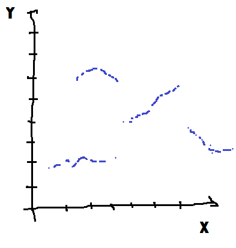

Gradient et méthodes ensemblistes
=================================

Le machine learning propose de nombreux modèles différents
pour construire une relation entre deux grandeur *X* et *Y*
mais l'idéal reste de constuire une relation la plus
synthétique qui soit. Plus elle est simple, plus elle
facile à interpréter.

.. index:: méthode ensembliste, méthode à base de gradient

On distingue deux grandes familles de modèles, ceux qui sont
appris grâce à des méthodes dites ensemblistes et ceux appris
grâce à des méthodes à base de gradient. La première famille
suppose peu de chose sur les données elle-même, la seconde suppose
que la relation est une fonction dérivable.

.. contents::
    :local:

Forces et différences
+++++++++++++++++++++

Les méthodes ensemblistes sont douées pour trouver relations
entre des valeurs précises de *X* et *Y*. *X* et *Y* sont en
quelque sorte discret mais cela fonctionne bien si ce nombre de
valeurs discrets n'est pas trop grande sinon la liste des
correspondances et très longue.

Les méthodes à base de gradient sont douées pour résumer une
relation dérivable (et donc continue) : si *X* croît de tant,
alors *Y* croît de tant.

.. list-table::
    :widths: 3 7 7
    :header-rows: 1

    * -
      - *X* discret
      - *X* continu
    * - *Y* discret
      - .. image:: images/xy_discret.png
            :width: 200
      - .. image:: images/xy_contdisc.png
            :width: 200
    * - *Y* continu
      - .. image:: images/xy_disccont.png
            :width: 200
      - .. image:: images/xy_continu.png
            :width: 200

Les deux cas sur la première diagonale sont les cas simples.
Dans le premier, tout est discret et les méthodes ensemblistes
sont plus performantes. Dans le dernier cas, tout est continu
et un modèle à base de gradient sera plus approprié. Si les deux
types de modèles obtiendront des performances similaires,
les modèles ensemblistes seront plus synthétiques dans le premier,
les modèles à base de gradient seront plus synthétiques et donc
interprétables dans le second.
Pour les deux cas sur l'autre diagonale, c'est souvent le caractère
de *Y* qui détermine le meilleur choix : les méthodes ensemblistes
pour le cas discret, les méthodes à gradient pour le cas continu.
Il existe également des cas indécidables où la relation est
dérivable par morceaux. Le meilleur modèle est alors un assemblage
des deux.

La méthode ensembliste la plus connu est
l':epkg:`arbre de décision`. Les autres modèles
comme la :epkg:`forêt aléatoire`
sont des déclinaisons. Le modèle à base
de gradient le plus simple est la
:epkg:`régression`. Les autres se caractérise par la
forme de la relation qu'ils sont capables de modéliser.
Le notebook suivant montre un cas où un arbre de décision,
une méthode ensembliste.

.. toctree::
    :maxdepth: 1

    ../notebooks/artificiel_duration_prediction

Distance, dérivée
+++++++++++++++++

La tentation est toujours d'utiliser un modèle avec plus
de degré de liberté et donc qui converge plus difficilement.
Il est parfois plus utile d'ajouter de nouvelles features :
`Features ou modèle <https://www.xavierdupre.fr/app/ensae_teaching_cs/helpsphinx2/_downloads/ml_features_model.html>`_.

Méthodes ensemblistes
+++++++++++++++++++++

* `Exercice 3 : variables corrélées pour un arbre de décision <http://www.xavierdupre.fr/app/ensae_teaching_cs/helpsphinx3/notebooks/ml_ccc_machine_learning_interpretabilite.html#exercice-3-variables-correlees-pour-un-arbre-de-decision>`_

* `overfitting <http://www.xavierdupre.fr/app/ensae_teaching_cs/helpsphinx3/notebooks/ml_a_tree_overfitting.html>`_

Variables catégorielles
+++++++++++++++++++++++
