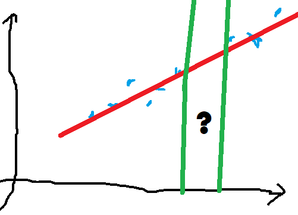

================================
Lectures sur le machine learning
================================

Le :epkg:`machine learning` répond à de plus en plus de
problématiques, beaucoup d'entre elles sont citées
sur ce cours `Python pour un Data Scientist / Economiste <http://www.xavierdupre.fr/app/ensae_teaching_cs/helpsphinx3/td_2a.html>`_
proposé à l':epkg:`ENSAE` qui comprend des exercices, des articles et les modules
qui implémentent quelques algorithmes.
Quelques thèmes liés au :epkg:`machine learning`
seront abordés en partant d'un jeu de données
pour explorer quelques points récurrents ou techniques.

.. toctree::
    :maxdepth: 1

    regclass
    nonsupervise
    otherml
    preprocessing
    gradienttree
    textembed
    seriestemp
    imagedeep

Le machine learning cache bien des choses mais
au final il s'agit de calculer une prédiction
pour un événement jamais observé. Ces techniques
synthétisent les observations passées pour en déduire
une réponse probable sur des observations futures.
Le nuage de points suivant représente ce qui a
été observé jusqu'à présent.

.. image:: images/nuage.png
    :width: 200

Le :epkg:`machine learning` propose une façon de construire
une fonction qui résume ou modèlise les observations passées.
Le résultat obtenu fait en quelque sorte une synthèse du passé pour
inférer une réponse probable à des événements
jamais observés. Dans le cas du nuage de point précédent,
on souhaite calculer une prédiction *y* pour
un *x* différent. Le machine learning prolonge un savoir
fait de résultat d'expérience. Autrement dit, le modèle de
machine learning pourra retourner une prédiction pour l'intervalle
:math:`x \in [50.105, 50.108]` alors que nous ne connaissons
la réponse qu'aux extrémités de cet intervalle.

