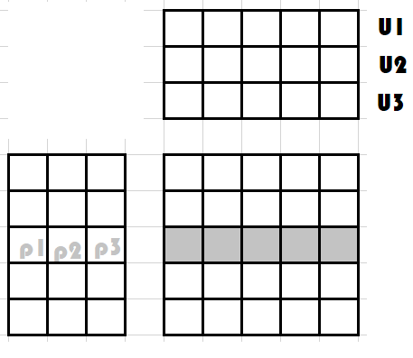

Quelques autres problèmes de machine learning
=============================================

.. contents::
    :local:

.. _l-recsys-section:

Système de recommandations
++++++++++++++++++++++++++

Problème
^^^^^^^^

Les systèmes de recommandations sont devenus plus populaires
après que *Netflix* a organisé une compétitions intitulée
`Netflix Prize <https://en.wikipedia.org/wiki/Netflix_Prize>`_
dans laquelle des équipes de data scientistes d'affrontent pour
déterminer le prix du meilleur systèmes de recommandations.
La recommandation consiste à proposer des suggestions, à guider
l'utilisateur dans l'index très grand de livres, de films ou autre
au mieux de ses goûts. Il faut retenir que pour ce problème, contrairement
à la régression ou la classification, un type événement
est observé, le fait qu'un utilisateur ait vu et aimé un film ou un livre.
On ne sait rien d'un film qu'il n'a pas vu mais c'est ce qu'on voudrait
savoir. Quels sont parmi tous les livres ou films disponibles
les films ou livres qu'il aimerait ?
Le problème est formalisé dans une matrice de la sorte, avec un ligne,
les utilisateurs, de l'autre les produits, chaque case de la matrice
vaut 1 si l'utilisateur a acheté le produit, 0 s'il ne l'a pas fait.
Il y a *U* utilisateurs et *P* produits.

.. math::

    M = \pa{\begin{array}{ccc} m_{11} & ... & m_{1P} \\ ... & ... & ... \\ m_{U1} & ... & m_{UP} \end{array}}

Chaque coefficient :math:`m_{ij} \in \acc{0,1}`,
elle est `creuse <https://fr.wikipedia.org/wiki/Matrice_creuse>`_
puisqu'un utilisateur n'a vu ou acheté qu'une petite partie des
produits. Et chaque coefficient nul est en fait inconnu, c'est une
observation qu'on cherche à dévenir, à prédire.
On suit la stratégie suivante : deux utilisateurs se ressemblent si
ils ont vu presque les mêmes films. Si l'un a vu un film et l'autre pas,
alors ce film est une bonne recommandation pour celui qui ne l'a pas vu.

Les deux utilisateurs ont vu presque les mêmes films sauf deux.
On peut supposer que les flèches rouges sont de bonnes recommandations
pour l'un est l'autre des utilisateurs.
Il existe deux stratégies principales pour répondre au
problème.

#. `Factorisation non-négative de matrices <https://fr.wikipedia.org/wiki/Factorisation_de_matrices_pour_les_syst%C3%A8mes_de_recommandation>`_
#. `Collaborative Filtering <https://en.wikipedia.org/wiki/Collaborative_filtering>`_

Le grand enjeu de ces système est l'ajout de nouvel utilisateur ou produit
pour lesquels aucune information n'est disponible puisque jamais montré.

Factorisation de matrice
^^^^^^^^^^^^^^^^^^^^^^^^

La première méthode consiste à écrire le problème de façon à trouver
deux matrices de rang inférieur (:math:`k \ll U,P:) de telle sorte
que :math:`M = WH`. La matrice *M* est de range très supérieur à *k*.
La contrainte *non-négative* limite la recherche de *WH* à des matrices
de coefficients positives : un utilisateur ne peut avoir qu'une
préférence positive.
Cette méthode ne peut produire qu'une approximation de la matrice
*M*. Dans le produit *WH*, on espère que les 1 seront remplacés
par des valeurs proches de 1 et les 0 par des valeurs non nulles.
On note le coefficient :math:`c_{ij}` un coefficient de la matrice
*WH*, l'ensemble :math:`\acc{c_{ij} | \forall j, \; m_{ij} = 0}`
représente les préférences du système pour tous les produits non vus
et non acheté par un utilisateur.

L'intuition de cet algorithme est détaillée par
`Liens entre factorisation de matrices l'ACP <http://www.xavierdupre.fr/app/mlstatpy/helpsphinx/c_ml/missing_values_mf.html>`_.
Si on oublie la contrainte de positivité des coefficients,
la matrice *H* contient *k* utilisateurs les plus représentatifs
- ils n'existent pas forcément -
de l'ensemble des utilisateurs, chaque ligne de la matrice
*WH* est une pondération de ces *k* utilisateurs et *W*
contient les coefficients de cette pondération.
On approche chaque utilisateur par une pondération
de *k* autres représentatifs.

L'analyse en composante principale et la méthode dite
`Singular Value Decomposition <https://en.wikipedia.org/wiki/Singular-value_decomposition>`_
(décomposition en valeurs singulière) sont équivalentes pour une matrice
carrée. La seconde est une extension dans le cas où la matrice à décomposer
n'est pas carrée ce qui est plus souvent le cas pour les systèmes de recommandation.
Mais l'ACP est plus connue.

.. toctree::
    :maxdepth:

    ..notebooks/movielens_fm

La méthode telle qu'elle est énoncée là ne prend que deux dimensions
en compte : utilisateur et produits mais la recommandation pourrait
tout à fait dépendre de la saison. Les solutions à ce problème à trois dimensions
généralisent la factorisation de matrice :
`Tensor rank decomposition <https://en.wikipedia.org/wiki/Tensor_rank_decomposition>`_.
La factorisation est peu adaptable à l'ajout de produit ou d'utilisateur.
Il faudra inférer une sorte de *warm start* ou d'initilisation à chaud
pour ces nouveaux éléments.

Collaborative filtering
^^^^^^^^^^^^^^^^^^^^^^^

La seconde méthode,
`collaborative filtering <https://en.wikipedia.org/wiki/Collaborative_filtering>`_
est assez proche dans l'esprit. Elle est préférable lorsqu'on sait un peu
de choses sur les films ou produits qu'un utilisateur n'a pas aimé ou moins aimé.
On transforme alors le problème en un autre qui ressemble plus à un problème
de régression ou classification puisqu'on construit une base d'apprentissage
avec le peu de labels dont on dispose. Cette méthode permet également d'agréger
d'autres sources d'information. Chaque observation de la base se compose
d'un vecteur de features et d'une cible : la note d'un utilisateur pour un film
précis. Le vecteur de features contient des features concernant :

* un utilisateur
* un produit
* l'interaction entre les deux

Cette méthode permet un peu plus facilement l'ajout d'un utilisateur, seules
les features liées à l'interactions manquent. Les autres (titre, résumé, prix,
âge, préférences...) sont disponibles.

Valeurs manquantes
^^^^^^^^^^^^^^^^^^

C'est une application des systèmes de recommandations :
on complète des valeurs manquantes en utilisant les résultats
issus d'une factorisation de matrice :
`Imputation de données manquantes <https://www.math.univ-toulouse.fr/~besse/Wikistat/pdf/st-m-app-idm.pdf>`_.

Ranking
+++++++
