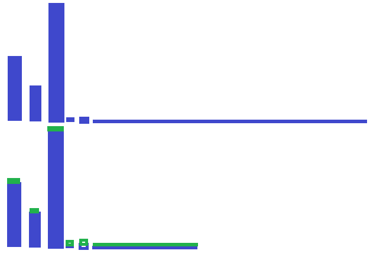

.. _l-preprocessing:

Prétraitement des données, données textuelles
=============================================

:epkg:`pandas` est souvent le point d'entrée d'un problème
de machine learning à savoir un fichier plat qu'on lit
avec la fonction :epkg:`pandas:reead_csv`. Lorsqu'on
regarde le code de :epkg:`scikit-learn`, on s'aperçoit que
ces données sont converties dans un tableau :epkg:`numpy`.
Pourquoi ? La réponse tient dans l'image qui suit :

.. image:: images/ml_simple.png
    :width: 250

:epkg:`pandas` sert à préparer les données, à transformer
tout ce qui n'est pas numérique en nombres réelles, à enrichir les données
en fusionnant avec d'autres bases. Une fois que cela est fait, on peut convertir
toutes les données au format numérique, en matrice pour simplfiier car les algorihmes
numériques utilisant principalement cela. Des nombres réels sous forme de matrices,
c'est ce que manipulent tous les algorithmes de machine learning.

.. contents::
    :local:

.. _l-norm-grad:

Prétraitements numériques
+++++++++++++++++++++++++

Le prétraitement des variables numériques dépend beaucoup
de la qualité des données reçues. Si le processus de récolte est manuel,
il faut s'attendre à quelques erreurs de saisie. Si le processus
de récolte est automatique comme pour un site web, il faut s'attendre
à quelques artefacts liés à son implémentation. Certains bugs
viennent également du fait que les données proviennent de la fusion
de plusieurs bases et que les données ont déjà été prétraitées
mais de façon différentes. Il n'existe pas de règles génériques.
Il faut toutefois garder à l'esprit que certains des prétraitement
ne sont pas nécessaires selon le modèle de machine learning
utilisé par la suite. La normalisation est en règle général
très utile si le modèle de machine learning s'apprend à l'aide
de méthode à gradient. Il n'est théoriquement pas nécessaire,
il est numérique préférable.

.. toctree::
    :maxdepth: 1

    ../notebooks/artificiel_normalisation

Normalisation, changement d'échelle, passage au logarithme,
suppression des valeurs extrêmes, construction de features
polynômiales, :epkg:`scikit-learn` donne une idée des prétraitements
numériques les plus courants :
`sklearn.preprocessing <http://scikit-learn.org/stable/modules/classes.html#module-sklearn.preprocessing>`_.

.. _l-new-features:

Ajout de variables et interprétabilité
++++++++++++++++++++++++++++++++++++++

La tentation est toujours d'utiliser un modèle avec plus
de degrés de liberté et donc qui converge plus difficilement.
Il est parfois plus utile d'ajouter de nouvelles features :
`Features ou modèle <https://www.xavierdupre.fr/app/ensae_teaching_cs/helpsphinx2/_downloads/ml_features_model.html>`_.
Pour résumer, lorsque la relation entre deux variables *X* et *Y*
n'est pas linéaire, on peut essayer de modéliser cette relation par
une fonction non linéaire et nécessairement plus coûteuse à construire
ou instroduire des variables supplémentaires telles que
:math:`X^2, \log X,` ... et garder un modèle linéaire.

Texte - catégorie
+++++++++++++++++

Le texte est rarement exploitable tel quel, il faut le convertir
au format numérique. On peut traiter l'information d'un seul bloc :
chaque valeur est distincte, il s'agit d'une catégorie. Le traitement
le plus simple consiste à convertir chaque valeur en une valeur numérique.
Les variations apparaissent car il faut tenir de la façon dont le modèle
de machine learning est appris (gradient ou méthode ensembliste), et
du nombre de catégories : il y en a trop parfois.

.. toctree::
    :maxdepth: 1

    ../notebooks/artificiel_category
    ../notebooks/artificiel_category_2
    ../notebooks/adult_cat

Une fonction de `hash <http://www.xavierdupre.fr/app/ensae_teaching_cs/helpsphinx3/notebooks/hash_distribution.html?highlight=hash>`_
possède des propriétés statistiques intéressantes car elle permet
de lisser une distribution. On s'en sert lorsque le nombre
de modalités est trop important. Plutôt que de choisir quelles
modalités regrouper ensemble, on fait appelle à une fonction de
*hash* pour compresser de façon aléatoire l'information.
La probabilité de faire un mauvais choix est assez faible.
On l'utilise principalement quand on a une minorité de
modalités sur-représentées et beaucoup de modalités sous-représentées.

La fonction *hash* va regrouper certaines modalités de façon aléatoire
pour espérer réduire la complexité du modèle et obtenir la distribution du bas
où la couleur verte symbolise des modalités non significatives
qui s'ajoutent à d'autres significatives ou non.

.. toctree::
    :maxdepth: 1

    ../notebooks/artificiel_category_hash

Texte - séquence
++++++++++++++++

.. index:: bag of words, sac de mots, analyse de sentiment

L'information peut aussi un texte libre qu'on peut découper
soit en mots ou en caractères, voire en syllabes. Il s'agit toujours
de convertir le texte en une information numérique. L'approche
`sac de mots <https://fr.wikipedia.org/wiki/Sac_de_mots>`_ est
très utilisée et une application courante est
l'`analyse de sentiment <https://fr.wikipedia.org/wiki/Opinion_mining>`_.

.. list-table::
    :header-rows: 1
    :widths: 2 10 5

    * - ligne
      - texte
      - sentiment
    * - 997
      - Ce film était super.
      - positif
    * - 1013
      - Je me suis ennuyé.
      - négatif
    * - 2147
      - Pas super.
      - négatif
    * - ...
      - ...
      - ...

Comment estimer le caractère positif ou négatif d'une critique
de film en partant d'une liste de critique et de l'évaluation
d'un expert ? On retrouve ce type de problématique
(texte + décision binaire) dans un nombre assez varié de problèmes :
ce mail est-il un spam, cette requête est-elle adulte,
ce commentaire est-il négatif...
Mais avant de commencer, on nettoie le texte et
on le découpe en mots.

.. index:: tokenization

Nettoyage - Tokenization
^^^^^^^^^^^^^^^^^^^^^^^^

Le texte brut contient beaucoup d'aléatoire
qui nuit à l'estimation des modèles : les accents, les
minuscules, les majuscules, les signes de ponctuation...
On peut les garder mais plus de variabilité implique plus
de données pour les apprendre. On préfère alors le nettoyer
avant de le découper en mot (ou caractères ou syllabe).
C'est la seule partie qui est spéficique au langage.
Même si langue latine partage les mêmes caractères,
elles n'ont pas les mêmes accents, la même façon de composer
les mots, les mêmes `stopwords <https://en.wikipedia.org/wiki/Stop_words>`_
ou *mots sans importance*.

.. toctree::
    :maxdepth: 1

    ../notebooks/artificiel_tokenize

Bags of words
^^^^^^^^^^^^^

La première approche
pour convertir le texte en features s'appelle
`bag of words <https://en.wikipedia.org/wiki/Bag-of-words_model>`_.
`sac de mots <https://fr.wikipedia.org/wiki/Sac_de_mots>`_.

.. toctree::
    :maxdepth: 1

    ../notebooks/artificiel_tokenize_features
    ../notebooks/text_sentiment_wordvec

Tagging
+++++++
