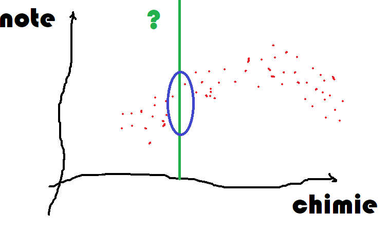
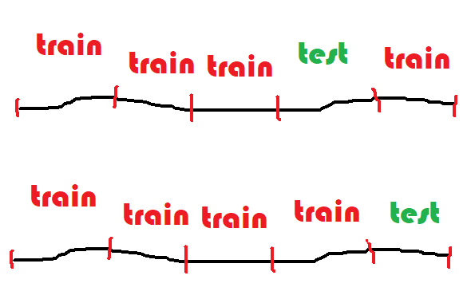

Classification et régression
============================

Le site :epkg:`UCI` propose de nombreux jeux de
de données utilisés dans un but pédagogique.
Parmi ceux-ci, on y trouve un jeu de données
sur le vin, `Wine Data Set <https://archive.ics.uci.edu/ml/datasets/wine>`_.
Pour ma part, j'ai goûté le vin assez tard, ne sachant véritablement
l'apprécier qu'à la trentaine avérée. Je suis encore incapable de
déchiffrer le vocabulaire qui sort de la bouche des experts
pour me contenter d'un *"j'aime"* ou *"j'aime pas"* loin
du caractère tanique ou parfumé du breuvage. Culture française
oblige, ce jeu de données pourrait convertir les mesures
issues d'une pipette, les composants chimiques du vin,
en une note gustative. Ce jeu est intéressant car il montre
que ce n'est pas si simple. J'aimerais pouvoir estimer la qualité
d'un vin en fonction de sa composition chimique. Deux usages
à cela, le premier pour choisir un vin sans avoir à le goûter,
le second s'il me prend l'envie d'être viticulteur afin
de pouvoir améliorer la qualité d'un vin en jouant sur ses
composants.

.. contents::
    :local:

* `Problèmes classiques de machine learning illustrés <http://www.xavierdupre.fr/app/ensae_teaching_cs/helpsphinx3/notebooks/ml_c_machine_learning_problems.html>`_
* `Machine Learning par Gaël Varoquaux <http://www.xavierdupre.fr/app/ensae_teaching_cs/helpsphinx3/all_notebooks.html#a-sklearn-ensae-course>`_

Finalité du machine learning
++++++++++++++++++++++++++++

On ne part pas de rien pour construire cette fonction, on dispose
de plusieurs milliers de notes données par des experts à des milliers
de vins dont on connaît les mêmes 12 informations sur leur composition,
ci-dessous, pour deux vins.

.. runpython::
    :rst:

    from pyquickhelper.pandashelper import df2rst
    from papierstat.datasets import load_wines_dataset
    df = load_wines_dataset()
    print(df2rst(df.head(n=2).T.reset_index(drop=False)))

On part du principe que si deux vins différents ont la même
composition, leurs qualités gustatives seront identiques.
6000 vins c'est à la fois beaucoup et pas beaucoup.
Si un vin inconnu a une composition identique à l'un des 6000 vins
répertoriés, on peut supposer qu'il obtiendra la même note.
Mais si sa composition est tout aussi nouvelle, que faire ?

Un des objectifs du :epkg:`machine learning` est de proposer
une façon de construire une note pour une composition nouvelle.
On appelle cela faire une **prédiction**. On souhaite en quelque sorte
étendre le savoir accumulé sur 6000 vins à de nouvelles compositions
de vins. Si les vins n'avaient qu'un seul composant chimique,
on obtiendrait le graphe suivant en positionnant chaque vin noté dans
la base en fonction de sa composante et de sa note.

Le trait vert correspond à la concentration de ce composé
pour un nouveau vin et elle est différente de toutes celles connues.
On se doute que la qualité de ce nouveau vin sera dans le cercle bleu
mais où ? C'est ce que nous allons voir.

Les données
+++++++++++

Le jeu de données peut être téléchargé depuis le site
`Wine Quality Data Set <https://archive.ics.uci.edu/ml/datasets/wine+quality>`_.
Il peut être également obtenu avec le code suivant :

.. runpython::
    :showcode:
    :rst:

    from pyquickhelper.pandashelper import df2rst
    from papierstat.datasets import load_wines_dataset
    df = load_wines_dataset()
    print(df2rst(df.head()))

.. plot::

    from papierstat.datasets import load_wines_dataset
    df = load_wines_dataset()

    import matplotlib.pyplot as plt
    plt.close('all')
    plt.style.use('ggplot')
    fig, ax = plt.subplots(nrows=1, ncols=1, figsize=(10,4))
    df.quality.hist(bins=18, ax=ax)
    plt.title('Distribution des notes des vins')
    plt.show()

Il y a plus de 6000 vins répertoriés.
Les très mauvais ou très bons vins sont peu nombreux,
c'est-à-dire que les notes sont distribuées de façon non uniforme.
Cela aura son importance plus tard. Toutefois, si la prédiction
dépend des observations passées, il est probable que le modèle soit
plus à l'aise là où il a le plus d'information. Les vins extrêmes,
peu représentés, seront sans doute moins bien appréhendés par
le modèle de prédiction.

Les plus proches voisins
++++++++++++++++++++++++

.. index:: plus proches voisins

Le modèle de prédiction le plus intuitif consiste à chercher pour
chaque nouveau vin le vin qui lui ressemble le plus parmi tous ceux connus.
On appelle cette méthode la méthode des
`plus proches voisins <https://fr.wikipedia.org/wiki/Recherche_des_plus_proches_voisins>`_.
Le module :epkg:`scikit-learn` implémente cet algorithme
`Nearest Neighbors <http://scikit-learn.org/stable/modules/neighbors.html>`_ et
on pourra s'inspirer de l'exemple
`Nearest Neighbors regression <http://scikit-learn.org/stable/auto_examples/neighbors/plot_regression.html#sphx-glr-auto-examples-neighbors-plot-regression-py>`_.

.. toctree::
    :maxdepth: 1

    ../notebooks/wines_knn
    ../notebooks/wines_knn_eval

A propos des plus proches voisins :
`Nearest Neighbours and Sparse Features <http://www.xavierdupre.fr/app/ensae_projects/helpsphinx/notebooks/nearest_neighbours_sparse_features.html>`_.

Train / test
++++++++++++

.. index:: bases apprentissage et test

Il n'est pas facile d'avoir une idée la pertinence
d'un modèle de prédiction. Le plus simple est de
comparer les prédictions obtenus avec la valeur de l'expert.
Comme le modèle des plus proches voisins retourne
toujours la bonne prédiction s'il a déjà vu un vin,
il faut nécessairement pouvoir lui en proposer de nouveau.

.. index:: base d'apprentissage, base de test

La base de données représente l'ensemble des données
à disposition. Il est impossible d'en amener de nouvelles
pour le moment. Il faudra s'en contenter.
On découpe alors les données en deux ensembles,
un pour apprendre, un pour tester. On les appelle
les bases d'apprentissage et de test. On compare
les prédictions aux valeurs attendues sur la base
de test.

.. toctree::
    :maxdepth: 1

    ../notebooks/wines_knn_split
    ../notebooks/wines_knn_split_strat

Validation croisée
++++++++++++++++++

.. index:: validation croisée, cross-validation

Il est acquis qu'un modèle doit être évalué sur une base de test différente
de celle utilisée pour l'apprentissage. Mais la performance est peut-être
juste l'effet d'une aubaine et d'un découpage particulièrement avantageux.
Pour être sûr que le modèle est robuste, on recommence plusieurs fois. On appelle
cela la *validation croisée* ou
`cross validation <https://en.wikipedia.org/wiki/Cross-validation_(statistics)>`_
en anglais. La base de données en découpée en :math:`n` segments,
5 le plus souvent, 4 segments servent à apprendre, le dernier
à tester. On permute 5 fois et cela donne cinq scores.

.. toctree::
    :maxdepth: 1

    ../notebooks/wines_knn_cross_val

Hyper-paramètres
++++++++++++++++

.. index:: hyper-paramètre

Un modèle de :epkg:`machine learning` est appris avec un
algorithme d'optimisation. Celui dépend de plusieurs paramètres,
le nombre de voisins dans le cas des plus proches voisins,
le pas de gradient pour un
`algorithme de descente de gradient <https://fr.wikipedia.org/wiki/Algorithme_du_gradient>`_.
Il est illusoire de penser que les mêmes paramètres donnent les meilleurs
résultats quelque soit le jeu de données considéré. Mais alors,
quels paramètres donnent les meilleurs résultats ?
La plus simple stratégie est d'essayer plusieurs valeurs et de
choisir la meilleur.

.. toctree::
    :maxdepth: 1

    ../notebooks/wines_knn_hyper

Un modèle de régression
+++++++++++++++++++++++

apprentissage

évaluation

Même problème sous l'angle de la classification
+++++++++++++++++++++++++++++++++++++++++++++++

apprentissage

évaluation

Modèles ou features
+++++++++++++++++++

`Features ou modèle <http://www.xavierdupre.fr/app/ensae_teaching_cs/helpsphinx3/notebooks/ml_features_model.html>`_

Pipeline
++++++++

Les vins bons sont rares
++++++++++++++++++++++++

smote

Overfitting
+++++++++++
