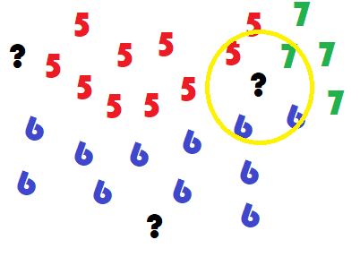
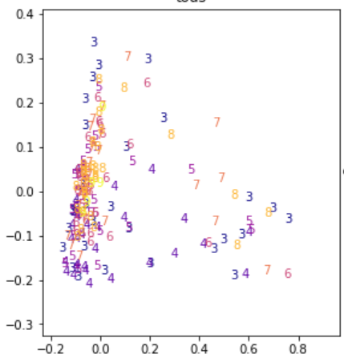
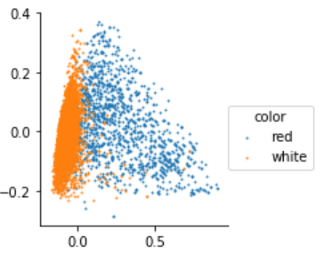
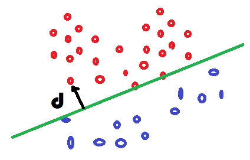

.. _l-regclass:

============================
Classification et régression
============================

Le site :epkg:`UCI` propose de nombreux jeux de
de données utilisés dans un but pédagogique.
Parmi ceux-ci, on y trouve un jeu de données
sur le vin, `Wine Data Set <https://archive.ics.uci.edu/ml/datasets/wine+quality>`_.
Pour ma part, j'ai goûté le vin assez tard, ne sachant véritablement
l'apprécier qu'à la trentaine avérée. Je suis encore incapable de
déchiffrer le vocabulaire qui sort de la bouche des experts
pour me contenter d'un *"j'aime"* ou *"j'aime pas"* loin
du caractère tanique ou parfumé du breuvage. Culture française
oblige, ce jeu de données pourrait convertir les mesures
issues d'une pipette, les composants chimiques du vin,
en une note gustative. Ce jeu est intéressant car il montre
que ce n'est pas si simple. J'aimerais pouvoir estimer la qualité
d'un vin en fonction de sa composition chimique. Deux usages
à cela, le premier pour choisir un vin sans avoir à le goûter,
le second s'il me prend l'envie d'être viticulteur afin
de pouvoir améliorer la qualité d'un vin en jouant sur ses
composants.

.. contents::
    :local:

*Quelques lectures :*

* `Problèmes classiques de machine learning illustrés <http://www.xavierdupre.fr/app/ensae_teaching_cs/helpsphinx3/notebooks/ml_c_machine_learning_problems.html>`_
* `Machine Learning par Gaël Varoquaux <http://www.xavierdupre.fr/app/ensae_teaching_cs/helpsphinx3/all_notebooks.html#a-sklearn-ensae-course>`_

Ce jeu de données peut également être téléchargé avec la fonction
:func:`load_wines_dataset <papierstat.datasets.wines.load_wines_dataset>`.

Découverte du machine learning
==============================

Finalité
++++++++

On ne part pas de rien pour construire cette fonction, on dispose
de plusieurs milliers de notes données par des experts à des milliers
de vins dont on connaît les mêmes 12 informations sur leur composition,
ci-dessous, pour deux vins.

.. runpython::
    :rst:

    from pyquickhelper.pandashelper import df2rst
    from papierstat.datasets import load_wines_dataset
    df = load_wines_dataset()
    print(df2rst(df.head(n=2).T.reset_index(drop=False)))

On part du principe que si deux vins différents ont la même
composition, leurs qualités gustatives seront identiques.
6000 vins c'est à la fois beaucoup et pas beaucoup.
Si un vin inconnu a une composition identique à l'un des 6000 vins
répertoriés, on peut supposer qu'il obtiendra la même note.
Mais si sa composition est tout aussi nouvelle, que faire ?

Un des objectifs du :epkg:`machine learning` est de proposer
une façon de construire une note pour une composition nouvelle.
On appelle cela faire une **prédiction**. On souhaite en quelque sorte
étendre le savoir accumulé sur 6000 vins à de nouvelles compositions
de vins. Si les vins n'avaient qu'un seul composant chimique,
on obtiendrait le graphe suivant en positionnant chaque vin noté dans
la base en fonction de sa composante et de sa note.

.. image:: images/ques.png
    :width: 300

Le trait vert correspond à la concentration de ce composé
pour un nouveau vin et elle est différente de toutes celles connues.
On se doute que la qualité de ce nouveau vin sera dans le cercle bleu
mais où ? C'est ce que nous allons voir.

Les données
+++++++++++

Le jeu de données peut être téléchargé depuis le site
`Wine Quality Data Set <https://archive.ics.uci.edu/ml/datasets/wine+quality>`_.
Il peut être également obtenu avec le code suivant :

.. runpython::
    :showcode:
    :rst:

    from pyquickhelper.pandashelper import df2rst
    from papierstat.datasets import load_wines_dataset
    df = load_wines_dataset()
    df = df[['fixed_acidity', 'volatile_acidity', 'citric_acid', 'quality']].copy()
    df['...'] = '...'
    print(df2rst(df.head()))

.. plot::

    from papierstat.datasets import load_wines_dataset
    df = load_wines_dataset()

    import matplotlib.pyplot as plt
    plt.close('all')
    plt.style.use('ggplot')
    fig, ax = plt.subplots(nrows=1, ncols=1, figsize=(10,4))
    df.quality.hist(bins=18, ax=ax)
    plt.title('Distribution des notes des vins')
    plt.show()

Il y a plus de 6000 vins répertoriés.
Les très mauvais ou très bons vins sont peu nombreux,
c'est-à-dire que les notes sont distribuées de façon non uniforme.
Cela aura son importance plus tard. Toutefois, si la prédiction
dépend des observations passées, il est probable que le modèle soit
plus à l'aise là où il a le plus d'information. Les vins extrêmes,
peu représentés, seront sans doute moins bien appréhendés par
le modèle de prédiction.

.. toctree::
    :maxdepth: 1

    ../notebooks/wines_knn_acp

.. index:: plus proches voisins

Les plus proches voisins
++++++++++++++++++++++++

Le modèle de prédiction le plus intuitif consiste à chercher pour
chaque nouveau vin le vin qui lui ressemble le plus parmi tous ceux connus.
On appelle cette méthode la méthode des
`plus proches voisins <https://fr.wikipedia.org/wiki/Recherche_des_plus_proches_voisins>`_.
Le module :epkg:`scikit-learn` implémente cet algorithme
`Nearest Neighbors <http://scikit-learn.org/stable/modules/neighbors.html>`_ et
on pourra s'inspirer de l'exemple
`Nearest Neighbors regression <http://scikit-learn.org/stable/auto_examples/neighbors/plot_regression.html#sphx-glr-auto-examples-neighbors-plot-regression-py>`_.
De façon un peu plus mathématique, on considère les données d'apprentissage
:math:`(X_i, y_i)_{i=1}^n`, le modèle construit une prédiction pour un :math:`x`
donné à partir de :math:`k` plus proches voisins. Ceux-ci vérifie :

.. math::

    \begin{array}{ll} V(k, X) = \acc{ i_{\sigma(1)}, ..., i_{\sigma(k)}} \\
    \text{avec} \; d(X, X_{\sigma(1)}) \leqslant ... \leqslant d(X, X_{\sigma(k)}) \leqslant d(X, X_j) \;
    \forall j \notin \acc{\sigma(1), ..., \sigma(k)} \end{array}

La prédiction est une moyenne des valeurs connues associées aux voisins trouvés :

.. math::

    f(X, k) = \frac{\sum_{i=1}^k y_{\sigma(i)}}{k}

Il s'agit maintenant d'appliquer cet algorithme afin de
prédire la note d'un vin pour trois vins représentés par
les trois points d'interrogations qui suivent.

Cette représentation simplifiée montre deux vins
plutôt simples à classer et un dernier - cercle jaune -
dont les voisins sont en désaccord quant à la décision
à prendre. Le vrai visage du jeu de données est plus
difficile à lire. Il est obtenu grâce à une
`analyse en composante principale (ACP) <https://fr.wikipedia.org/wiki/Analyse_en_composantes_principales>`_
qui projette un ensemble de points dans un espace de dimension réduite
en maximisant la variance de l'ensemble projeté.

Peut-être que la prédiction sera facile mais ce n'est
pas cette représentation qui permet de nous en assurer.

.. toctree::
    :maxdepth: 1

    ../notebooks/wines_knn
    ../notebooks/wines_knn_eval

.. index:: ball tree

Les plus proches voisins est un des modèles les plus simples
avec le modèle linéaire, il est néanmoins très coûteux à calculer
puisqu'il faut a priori s'enquérir de toutes les distances entre
un nouveau point et ceux déjà connus. Des algorithmes permettent
d'accélérer la recherche de voisins comme les
`ball tree <https://en.wikipedia.org/wiki/Ball_tree>`_.
Ils sont de moins en moins
efficaces au fur et à mesure que la dimension de l'espace
des features augmente :
`Nearest Neighbours and Sparse Features <http://www.xavierdupre.fr/app/ensae_projects/helpsphinx/notebooks/nearest_neighbours_sparse_features.html>`_.

Trois étapes récurrentes
========================

.. index:: bases d'apprentissage et de test, train_test_split

Train / test
++++++++++++

Il n'est pas facile d'avoir une idée la pertinence
d'un modèle de prédiction. Le plus simple est de
comparer les prédictions obtenus avec la valeur de l'expert.
Comme le modèle des plus proches voisins retourne
toujours la bonne prédiction s'il a déjà vu un vin,
il faut nécessairement pouvoir lui en proposer de nouveau.

La base de données représente l'ensemble des données
à disposition. Il est impossible d'en amener de nouvelles
pour le moment. Il faudra s'en contenter.
On découpe alors les données en deux ensembles,
un pour apprendre, un pour tester. On les appelle
les bases d'apprentissage et de test. On compare
les prédictions aux valeurs attendues sur la base
de test.

.. toctree::
    :maxdepth: 1

    ../notebooks/wines_knn_split
    ../notebooks/wines_knn_split_strat

.. index:: validation croisée, cross-validation

Validation croisée
++++++++++++++++++

Il est acquis qu'un modèle doit être évalué sur une base de test différente
de celle utilisée pour l'apprentissage. Il suffit de penser aux plus proches
voisins dont le nombre d'erreurs sur la base d'apprentissage est toujours nul.
Mais la performance sur la base de test est peut-être
juste l'effet d'une aubaine et d'un découpage particulièrement avantageux.
Pour être sûr que le modèle est robuste, on recommence plusieurs fois. On appelle
cela la *validation croisée* ou
`cross validation <https://en.wikipedia.org/wiki/Cross-validation_(statistics)>`_
en anglais. La base de données en découpée en :math:`n` segments,
5 le plus souvent, 4 segments servent à apprendre, le dernier
à tester. On permute 5 fois et cela donne cinq scores.

.. image:: images/cross.png
    :width: 200

.. toctree::
    :maxdepth: 1

    ../notebooks/wines_knn_cross_val

.. index:: hyper-paramètre

Hyper-paramètres
++++++++++++++++

Un modèle de :epkg:`machine learning` est appris avec un
algorithme d'optimisation. Celui dépend de plusieurs paramètres,
le nombre de voisins dans le cas des plus proches voisins,
le pas de gradient pour un
`algorithme de descente de gradient <https://fr.wikipedia.org/wiki/Algorithme_du_gradient>`_.
Il est illusoire de penser que les mêmes paramètres donnent les meilleurs
résultats quelque soit le jeu de données considéré. Mais alors,
quels paramètres donnent les meilleurs résultats ?
La plus simple stratégie est d'essayer plusieurs valeurs et de
choisir la meilleure.

.. toctree::
    :maxdepth: 1

    ../notebooks/wines_knn_hyper

Deux problèmes à la base de beaucoup d'autres
=============================================

.. index:: régression

.. _l-regression-f:

Régression
++++++++++

Le bruit blanc est une variable aléatoire couramment utilisé
pour désigner le hasard ou la part qui ne peut être modélisée
dans une régression ou tout autre problème d'apprentissage.
On suppose parfois que ce bruit suive une loi normale.

.. mathdef::
    :title: bruit blanc
    :tag: Définition
    :lid: def-bruit-blanc

    Une suite de variables aléatoires réelles
    :math:`\pa{\epsilon_i}_{1 \infegal i \infegal N}`
    est un bruit blanc :

    * :math:`\exists \sigma > 0`, :math:`\forall i \in \intervalle{1}{N}, \; \epsilon_i \sim \loinormale{0}{\sigma}`
    * :math:`\forall \pa{i,j} \in \intervalle{1}{N}^2, \; i \neq j \Longrightarrow \epsilon_i \independant \epsilon_j`

La prédiction de la note des vins est un problème de
`régression <http://www.xavierdupre.fr/app/mlstatpy/helpsphinx/c_ml/rn/rn_2_reg.html>`_
et cela consiste à résoudre le problème suivant :

.. mathdef::
    :title: Régression
    :tag: Problème
    :lid: problem-regression

    Soient deux variables aléatoires :math:`X` et :math:`Y`,
    l'objectif est d'approximer la fonction
    :math:`\esp\pa{Y | X} = f\pa{X}`.
    Les données du problème sont
    un échantillon de points :math:`\acc{ \pa{ X_{i},Y_{i} } | 1 \infegal i \infegal N }`
    et un modèle paramétré avec :math:`\theta` :

    .. math::

            \forall i \in \intervalle{1}{N}, \; Y_{i} = f \pa{\theta,X_{i}} + \epsilon_{i}

    avec :math:`n \in \N`,
    :math:`\pa{\epsilon_{i}}_{1 \infegal i \infegal N}` :ref:`bruit blanc <def-bruit-blanc>`,
    :math:`f` est une fonction de paramètre :math:`\theta`.
		

La fonction :math:`f` peut être une fonction linéaire,
un polynôme, un réseau de neurones...
Lorsque le bruit blanc est normal, la théorie de l'estimateur
de vraisemblance (voir [Saporta2006]_) permet d'affirmer
que le meilleur paramètre :math:`\hat{\theta}`
minimisant l'erreur de prédiction est :

.. math::

    \hat{\theta} = \underset {\theta \in \R^p}{\arg \min} \; \esp \pa {\theta}
			     = \underset {\theta \in \R^p}{\arg \min}
                   \cro{ \sum_{i=1}^{N} \cro{Y_{i}-f \pa{\theta,X_{i}}}^{2}}

Le lien entre les variables :math:`X` et :math:`Y` dépend des hypothèses faites
sur :math:`f`. Généralement, cette fonction n'est supposée non linéaire
que lorsqu'une `régression linéaire <https://fr.wikipedia.org/wiki/R%C3%A9gression_lin%C3%A9aire>`_
donne de mauvais résultats.
:epkg:`scikit-learn` implémente de nombreux modèles de
`régression <http://scikit-learn.org/stable/supervised_learning.html#supervised-learning>`_.

.. toctree::
    :maxdepth: 1

    ../notebooks/wines_reg
    ../notebooks/wines_reg_poly

.. _l-classification-f:

Classification
++++++++++++++

Le notebook sur l'ACP a mis en lumière que les vins blancs
et rouges pourraient être différents chimiquement et il devrait
être possible de prédire la couleur en fonction des données
disponibles dans ce jeu de données.
Ce problème n'est pas une régression puisque la cible à prédire
n'est pas une quantité mais une information booléenne ou binaire :
blanc ou rouge. La frontière dans les deux
couleurs se dessine dans l'image ci-dessous mais comment
déterminer cette frontière ?

La modélisation de ce problème commence par construire deux probabilités
pour un vin définies par :math:`X_i`
:math:`\pr{rouge | X_i}` et :math:`\pr{blanc | X_i}` qu'on prononce
comme étant la probabilité que la couleur du vin soit rouge ou blanche
connaissant :math:`X_i`. Comme il n'y a que deux possibilités et qu'un vin
ne peut être des deux couleurs à la fois :
:math:`\pr{rouge | X_i} + \pr{blanc | X_i} = 1`. La frontière est l'ensemble
des points pour lesquelles ces probabilités sont égales,
:math:`\acc{X | \pr{rouge | X} =\pr{blanc | X}}`, ou encore :

.. math::

    \frac{\pr{rouge | X}}{\pr{blanc | X}} = 1 \Leftrightarrow
    \ln \frac{\pr{rouge | X}}{\pr{blanc | X}} = f(X) = 0

Il reste à expliciter la fonction *f*. On remarque que si *f*
est linéaire, la séparation entre les deux classes sera une droite.
On va voir comment relier cela à
la probabilité d'appartenance à une classe.

.. index:: loi logistique, régression logistique

La `régression logisitique <https://fr.wikipedia.org/wiki/R%C3%A9gression_logistique>`_
relie cette probabilité à la distance :math:`\bar{d}(X)` à la frontière
entre les deux classes via une
`loi logistique <https://fr.wikipedia.org/wiki/Loi_logistique>`_,
presqu'une distance dans la mesure où la fonction :math:`\bar{d}` est positive
d'un côté et négative de l'autre.

.. math::

    \pr{rouge | X} = \frac{1}{1 + e^{\bar{d}(X)}}

On vérifie que lorsque la distance est nulle, la probabilité
vaut :math:`\frac{1}{2}` et que :math:`f(X) \in [0, 1] \; \forall X`.
On écrit la fonction *f* :

.. math::

    f(X) = \ln\frac{ \frac{1}{1 + e^{\bar{d}(X)}} }{ 1 - \frac{1}{1 + e^{\bar{d}(X)}} } =
    \ln\frac{ \frac{1}{1 + e^{\bar{d}(X)}} }{ \frac{e^{\bar{d}(X)}}{1 + e^{\bar{d}(X)}} } =
    -\bar{d}(X)

La régression logistique suppose que la fontière est une droite.
Dans ce cas, la `distance à une droite <https://fr.wikipedia.org/wiki/Distance_d%27un_point_%C3%A0_une_droite>`_
s'écrit :math:`f(X) = \beta_0 + \beta^T X` si :math:`\norme{\beta} = 1`.
Maintenant que les probabilités sont définies, on peut écrire la
log-vraisemblance du problème (:math:`y_i \in \acc{0,1}`).
On suppose tous les points :math:`X_i` équiprobable.

.. math::

    \begin{array}{rcl}
    \ln L(X_1,...,X_n, y_i,...,y_n)
    &\propto& \sum_{i=1}^n y_i \ln \pr{rouge | X_i} + (1-y_i) \ln \pr{blanc| X_i}  \\
    &=& \sum_{i=1}^n y_i \ln \frac{\pr{rouge | X_i}}{\pr{blanc| X_i}}  + \ln \pr{blanc| X_i}  \\
    &=& \sum_{i=1}^n \frac{y_i}{1 + e^{f(X_i)}} + \frac{(1 - y_i)e^{f(X_i)}}{1 + e^{f(X_i)} } \\
    &=& \sum_{i=1}^n \frac{y_i}{1 + e^{f(X_i)}} + \frac{1 - y_i}{1 + e^{-f(X_i)}}
    \end{array}

.. index:: Kullbak-Leiber, log-loss, fonction de coût

La quantité suivante correspond à la
`distance de Kullbak-Leiber <https://fr.wikipedia.org/wiki/Divergence_de_Kullback-Leibler>`_
entre deux distributions discrètes :math:`Y_i`
et la prédiction du modèle :math:`P_i`.

.. math::

    \begin{array}{rcl}
    Kullback-Leiber(Y,P) &=& y_i \ln \pr{rouge | X_i} + (1-y_i) \ln(1 - \pr{rouge | X_i}) \\
    &=& y_i \ln p(X_i) + (1-y_i) \ln(1 - p(X_i)))
    \end{array}

Les deux problèmes, classification et régression, sont sont similaires.
Seule la fonction de coût change : cette fonction évalue quantitativement
la distance entre la prédiction du modèle et la réponse attendue.
La régression précédente utilise une fonction de coût quadratique,
la classification utilise une fonction
`log-loss <http://wiki.fast.ai/index.php/Log_Loss>`_.
Pour résumer :

.. mathdef::
    :title: Classification binaire
    :tag: Problème
    :lid: problem-classification

    Soient deux variables aléatoires :math:`X` et :math:`Y \in \N`,
    l'objectif est d'approximer la fonction
    :math:`\esp\pa{Y | X} = f\pa{X}`.
    Les données du problème sont
    un échantillon de points :math:`\acc{ \pa{ X_{i},Y_{i} } | 1 \infegal i \infegal N }`
    et un modèle paramétré avec :math:`\theta` :

    .. math::

            \forall i \in \intervalle{1}{N}, \; Y_{i} = \left\{ \begin{array}{l}
            1 \text{ si } f \pa{\theta, X_{i}} + \epsilon_i > 0 \\
            0 \text{ sinon }
            \end{array}\right.

    avec :math:`n \in \N`,
    :math:`\pa{\epsilon_{i}}_{1 \infegal i \infegal N}` une variable aléatoire,
    :math:`f` est une fonction de paramètre :math:`\theta`.

.. toctree::
    :maxdepth: 1

    ../notebooks/wines_color
    ../notebooks/wines_color_line
    ../notebooks/wines_color_roc

Les modèles linéaires sont simples, robustes, interprétables.
Un modèle plus compliqué améliore souvent les performances.
Il est possible aussi d'ajouter des variables construites
de façon non linéaire à partir des premières. Le procédé est plus
ou moins automatique mais donne parfois de bons résultats :
`Features ou modèle <http://www.xavierdupre.fr/app/ensae_teaching_cs/helpsphinx3/notebooks/ml_features_model.html>`_.

.. _l-multiclass:

Classification multi-classe
+++++++++++++++++++++++++++

La régression nous a permis de prédire une note.
La cible à prévoir est un peu particulière dans ce problème
puisque la note est entière et prend peu de valeurs distinctes.
Chaque vin peut être considéré comme faisant partie du groupe
associé à tous les vins portant la même note. Ce problème
est différent du précédent car il y a plus de deux classes.
Certains modèles sont estimées de la même façon que s'il
s'agissait de deux classes comme les réseaux de neurones.
D'autres converstissent d'abord le problème en une succession
de problème de classification binaires avant de fusionner leurs
réponses. Il existe deux stratégies :
`OneVsRest <http://scikit-learn.org/stable/modules/generated/sklearn.multiclass.OneVsRestClassifier.html>`_,
`OneVsOne <http://scikit-learn.org/stable/modules/generated/sklearn.multiclass.OneVsOneClassifier.html#sklearn.multiclass.OneVsOneClassifier>`_.

La première stratégie consiste à apprendre *K* classifieurs
pour *K* classes. Chaque classe apprend une classe contre toutes
les autres. Supposons qu'on dispose des données :math:`(X_i, y_i)`
avec :math:`y_i \in \acc{1, ..., k}`. Le classifieur binaire :math:`C_k`
est appris avec les données :math:`(X_i, \indicatrice{y_i = k})`.
L'observation est affectée à la classe qui maximise
le score de classification :

.. math::

    k^* = \underset{k \in \acc{1,...,K}}{\arg \max} C_k(X_i)

L'autre approche convertit le problème initiale en
:math:`\frac{k(k-1)}{2}` classifications binaires. Une classifieur
est appris pour chaque paire de classes. Cette stratégie n'est pas
nécessairement plus longue lors de l'apprentissage, mais elle l'est
certainement lors de la prédiction. La classe prédite est celle
qui a remporté le plus de *match* en un contre un.

.. index:: imbalanced

Paradoxalement, cette stratégie est préférable lorsque le
nombre de classes est grand car les jeux de données ne sont pas
déséquilibrés lors de l'apprentissage (voir [Furnkranz2002]_).

.. toctree::
    :maxdepth: 1

    ../notebooks/wines_multi
    ../notebooks/artificiel_multiclass

Ces approches ont néanmoins un léger inconvénient qui est d'avoir
plusieurs classifieurs dont les scores ne sont pas nécessairement
comparables : le premier classifieur peut classer un élément dans
la classe 1 avec une probabilité de 0.60 et le second dans la classe 2
avec une probabilité de 0.59. Ces probabilités ne sont pas
nécessairement comparables mais surtout comme elles sont très proches,
il est raisonnable de penser que, si chaque classifieur est pertinent,
l'ensemble est plutôt hésitant. On peut améliorer les performances
avec une méthode de :ref:`stacking` et des modèles qui supportent
nativement la multi-classification.

.. toctree::
    :maxdepth: 1

    ../notebooks/wines_multi_stacking

.. _l-sklearn-programmation:

Machine learning et programmation
+++++++++++++++++++++++++++++++++

L'`API de scikit-learn <http://www.xavierdupre.fr/app/ensae_teaching_cs/helpsphinx3/notebooks/02_basic_of_machine_learning_with_scikit-learn.html#a-recap-on-scikit-learn-s-estimator-interface>`_
se résume à peu de choses et permet déjà de faire des choses assez
puissantes. On peut par exemple faire de l'optimisation d'hyperparamètres
sur des assemblages de *transform*, *learner*. On appelle
un tel assemblage un `pipeline <http://scikit-learn.org/stable/modules/generated/sklearn.pipeline.Pipeline.html>`_.
Le résultat se comporte comme un modèle ou *learner*, il implémente
les mêmes fonctions.

.. runpython::
    :showcode:

    from sklearn import svm
    from sklearn.datasets import make_classification
    from sklearn.feature_selection import SelectKBest
    from sklearn.feature_selection import f_regression
    from sklearn.pipeline import Pipeline
    X, y = make_classification(n_informative=5, n_redundant=0, random_state=42)

    anova_filter = SelectKBest(f_regression, k=5)
    clf = svm.SVC(kernel='linear')

    anova_svm = Pipeline([('anova', anova_filter), ('svc', clf)])
    anova_svm.fit(X, y)
    print(anova_svm)

Lorsqu'on répète souvent le même traitement,
on a tout intérêt à implémenter celui-ci sous la forme
d'un `transformer <http://scikit-learn.org/stable/modules/generated/sklearn.base.TransformerMixin.html>`_
ou d'un `estimator <http://scikit-learn.org/stable/modules/generated/sklearn.base.BaseEstimator.html#sklearn.base.BaseEstimator>`_.
Une fois ceci fait, il devient facile de répéter le même traitement
dans beaucoup de pipeline. Il faut bien sûr implémenter les
méthodes *fit*, *predict*, *predict_proba*, *transform*.
Mais il faut vérifier voire implémenter
aussi les méthodes *get_params* et *set_params qui permettent
aux fonctions de :epkg:`scikit-learn` de
`cloner <http://scikit-learn.org/stable/modules/generated/sklearn.base.clone.html#sklearn.base.clone>`_
un modèle. La classe :class:`SkBaseLearnerCategory <papierstat.mltricks.sklearn_base_learner_category.SkBaseLearnerCategory>`
implémente un modèle qui en contient plusieurs. Il n'hérite pas
de la classe `BaseEstimator <http://scikit-learn.org/stable/modules/generated/sklearn.base.BaseEstimator.html#sklearn.base.BaseEstimator>`_
de façon à laisser tous les traits de construction apparents.
Le notebook suivant revient sur ce modèle et ce qu'il permet
d'automatiser.

.. toctree::
    :maxdepth: 1

    ../notebooks/wines_color_linear

Exercices
+++++++++

* `Arbres de décision / Random Forest <http://www.xavierdupre.fr/app/ensae_teaching_cs/helpsphinx3/notebooks/td2a_cenonce_session_3B.html>`_
* `Machine Learning et Marketting <http://www.xavierdupre.fr/app/ensae_teaching_cs/helpsphinx3/notebooks/td2a_cenonce_session_4A.html>`_
* `Tree, overfitting <http://www.xavierdupre.fr/app/ensae_teaching_cs/helpsphinx3/notebooks/ml_a_tree_overfitting.html>`_
* `Comparaison de deux régressions <http://www.xavierdupre.fr/app/actuariat_python/helpsphinx/notebooks/enonce_2017.html#enonce2017rst>`_

Bibliographie
+++++++++++++

.. [Saporta2006] Probabilités, analyse des données et statistique,
    Gilbert Saporta, Editions Technip

.. [Furnkranz2002] `Round Robin Classification <http://www.jmlr.org/papers/volume2/fuernkranz02a/fuernkranz02a.pdf>`_,
    Johannes Fürnkranz
