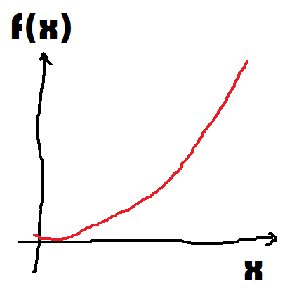
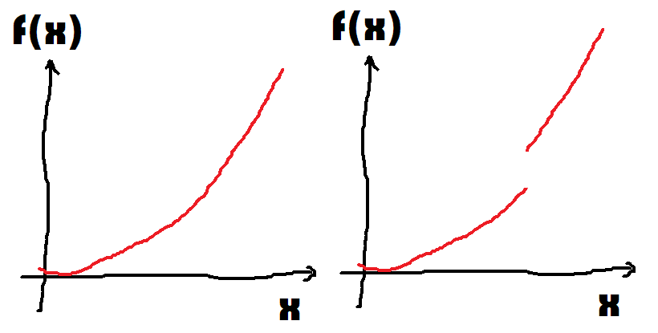
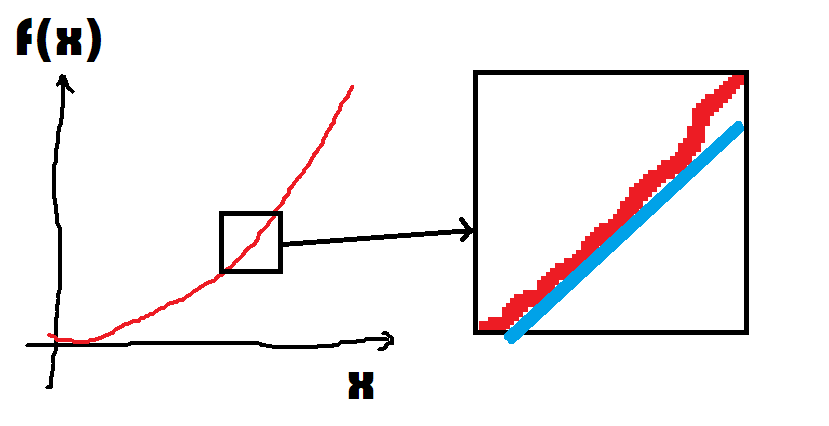
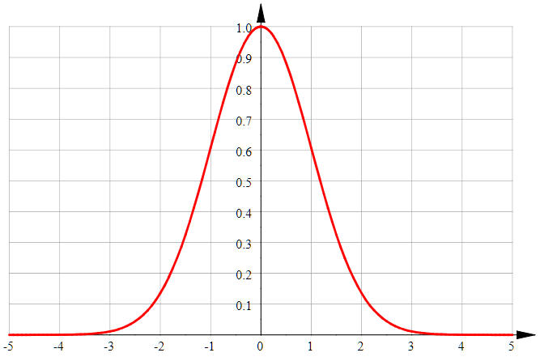
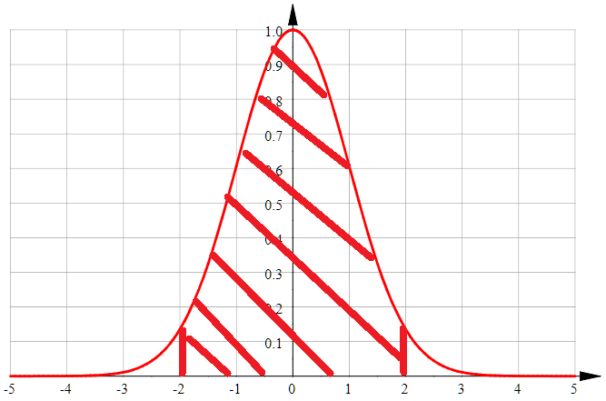
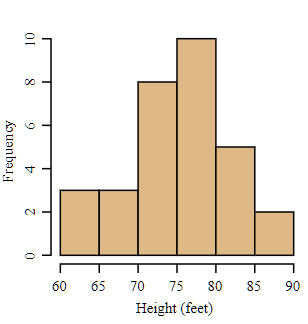
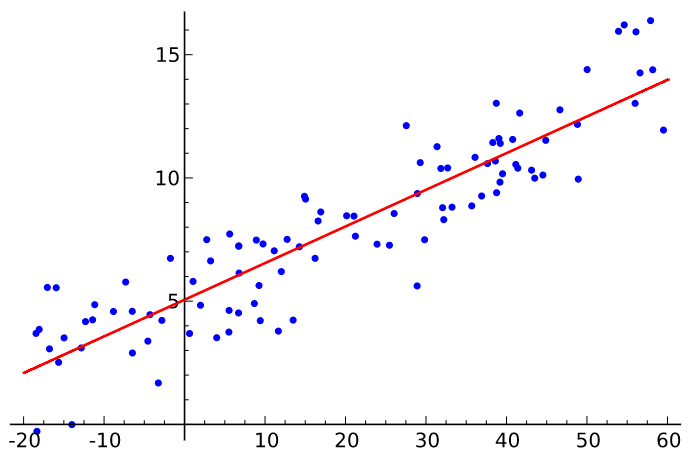

.. _l-rappel:

================
Quelques rappels
================

Sans rentrer véritablement dans le détail,
cette partie rappelle quelques notions qui apparaissent à
de nombreux endroits. Ces éléments mathématiques et informatiques
sont nécessaires afin de comprendre comment fonctionnent les
modèles de machine learning exposés.

.. contents::
    :local:
    :depth: 1

*Les illustrations sont soit faites maisons soit extraites de Wikipedia.*

Rappels mathématiques
=====================

.. index:: fonction

Fonction
++++++++

Une `fonction <https://fr.wikipedia.org/wiki/Fonction_(math%C3%A9matiques)>`_
:math:`f` symbolise le lien entre deux grandeurs
:math:`x` et :math:`f(x)` qu'on note
:math:`x \rightarrow f(x)` ou :math:`y=f(x)`.
Par exemple, :math:`x \rightarrow f(x)=x^2` est la fonction
qui associe à un nombre son carré.
Le graphe suivant représente ce lien :

.. index:: fonction continue

Fonction continue
+++++++++++++++++

Une `fonction continue <https://fr.wikipedia.org/wiki/Continuit%C3%A9_(math%C3%A9matiques)>`_
signifie en gros que si :math:`x` varie un petit peu, :math:`f(x)` varie aussi un petit peu.
On exprime cette propriété comme suit en terme mathématique.

.. math::

    \forall \epsilon >0, \exists \eta, \forall x,y \in I, \; \abs{x-y} < \eta \Rightarrow \abs{f(x) -f(y)} < \epsilon

On résume visuellement cette propriété comme suit.
La fonction de gauche est continue, celle de droite ne l'est pas.

Les puristes vous diront qu'il existe quelques cas intéressants
qui sont trompeurs visuellement mais cela suffira pour comprendre
les notions de machine learning.

.. index:: fonction dérivable

Fonction dérivable
++++++++++++++++++

Beaucoup de fonctions continues sont dérivables mais ce qui est sûr,
c'est la fonction qui n'est pas continue en un point :math:`x`
ne peut pas être dérivable en ce point mais elle peut l'être ailleurs.
Et pour être plus précis, une fonction dérivable en un point :math:`x`
signifie, quand on y regarde de près, qu'elle n'est pas très loin de
ressembler à une droite.

Et comme elle y ressemble fortement, on n'a pas besoin de la connaître
très bien pour savoir si on monte ou on descend quand on va à gauche
ou à droite. Il existe des fonctions :math:`f` qui sont si compliquées
à écrire que les connaître se révèle un défi. Quand elles sont dérivables,
on peut les confondre localement à une droite qu'on sait le plus souvent
calculer. C'est une information très précieuse quand on cherche à
trouver le minimum. Sans hésiter, sur ce dessin, vous iriez à gauche,
et tout ça grâce au fait que la fonction est dérivable.
Mathématiquement, cela signifie que la fonction :math:`g` admet une
limite lorsque :math:`h` tend vers 0.

.. math::

        g(x, h) = \frac{f(x+h) - f(x)}{h}

.. index:: espace vectoriel

Espace vectoriel
++++++++++++++++

Jusqu'à présent, :math:`x` avait plutôt la tête d'un nombre
et c'était pratique à dessiner mais notre poisson rouge était
décrit par sa position, soit un couple :math:`(x,y)`.
Beaucoup de fonctions en machine learning s'écrivent
:math:`f(X)` où :math:`X=(x_1, ..., x_n)` est un vecteur
de :math:`n` coordonnées. Ca ne change pas grand-chose sauf
que c'est plus compliqué à dessiner voire impossible.
Il faudra faire avec.

.. index:: produit scalaire

Produit scalaire
++++++++++++++++

Le produit scalaire est un
`opérateur bilinéaire <https://fr.wikipedia.org/wiki/Application_bilin%C3%A9aire>`_,
il est utilisé pour définir la norme d'un vecteur, il est relié aussi à
l'angle qui les sépare.

.. math::

    <X,Y> = \sum_{i=1}^n x_i y_i = \norm{X}\norm{Y} \cos(X,Y)

.. index:: norme, distance

Norme
+++++

La norme est pour simplifier une distance entre deux
vecteurs. La distance euclidienne est nommé *norme L2* :

.. math::

    \norm{X}_2 = \sqrt{<X,X>}

La norme L1 utilise les valeurs absolues :

.. math::

    \norm{X}_1 = \sum_{i=1}^n \abs{x_i}

Ce sont les deux principales normes utilisées en
:epkg:`machine learning`.

.. index:: matrice

Matrice
+++++++

Les `matrices <https://fr.wikipedia.org/wiki/Matrice>`_ sont
incontournables. Ces simples tableaux de nombres viennent
avec les opérations comme la multiplication, l'addition,
la `transposée <https://fr.wikipedia.org/wiki/Matrice_transpos%C3%A9e>`_...
Elles simplifient beaoucoup l'écriture des calculs et interviennent
dans tous les modèles linéaires.

.. math::

    M = \pa{\begin{array}{ccc} m_{11} & ... & m_{1k} \\ ... & ... & ... \\ m_{l1} & ... & m_{kl} \end{array}}

Les notations mathématiques utilisent le plus souvent
les minuscules pour représenter un nombre, les majuscules
pour représenter un vecteur ou une matrice, les lettres grecques
pour des nombres très petits utilisés comme intermédiaires de
calcul.

.. index:: problème d'optimisation

Problème d'optimisation
+++++++++++++++++++++++

C'est le vif du sujet. Le :epkg:`machine learning` commence par
exprimer de façon mathématique un problème à résoudre,
et le plus souvent cette réflexion à un problème
d'optimisation comme le suivant :

.. math::

    \min_W \frac{1}{n} \sum_{i=1}^n (f(W, X_i) - y_i)^2

Le problème se résoud avec une méthode à base de gradient
lorsque la fonction :math:`f` est dérivable comme la méthode
de `Newton <https://fr.wikipedia.org/wiki/M%C3%A9thode_de_Newton>`_,
l'algorithme du `gradient <https://fr.wikipedia.org/wiki/Algorithme_du_gradient>`_.

.. image:: images/Gradient_descent.png
    :width: 200

.. index:: variable aléatoire

Variable aléatoire
++++++++++++++++++

C'est un concept qui permet de synthétiser une information,
de saisir la variabilité d'une donnée en peu de termes.
Un biologiste a mesuré la taille d'une centaine de poissons rouges,
voici quelques exemples :

::

    10.2 10.1 9.9 13.5 ...

Il raconte sa journée à son ami et se met en tête de réciter
tous les nombres qu'il a observés. Voyant son ami qui s'endort,
il finit par lui dire que la taille des poissons rouges est
comprise entre 9.5 cm et 14.1 cm. Son ami paresseux lui retourne :
"Donc si je prends un nombre au hasard entre ces deux extrémités,
j'aurai une taille de poissons rouges."

C'est l'idée d'une
`variable aléatoire <https://fr.wikipedia.org/wiki/Variable_al%C3%A9atoire>`_.
Cela résume la façon dont une chose peut varier. Un nombre aléatoire
choisi dans un intervalle est appelé
`loi uniforme <https://fr.wikipedia.org/wiki/Loi_uniforme_continue>`_.
La loi la plus connue est la `loi normale <https://fr.wikipedia.org/wiki/Loi_normale>`_
qu'on connaît aussi sous la forme d'un chapeau.

Ce graphique représente une fonction :math:`f(x)` et celle-ci indique la probabilité
de tirer un nombre égale à :math:`x` selon une loi normale. Ce dessine nous dit
que ce nombre aléatoire a plus de chance d'être petit que grand. On peut même dire
que ce nombre aléatoire a 95% de chance d'être entre -2 et 2.

Une variable aléatoire résume une dizaine, une centaine, un millier,
une infinité de nombres fabriqués de la même manière, la taille d'une personne,
la durée de vie d'une ampoule, l'efficacité d'un traitement médical...

.. index:: histogramme

Histogramme
+++++++++++

L'histogramme est un graphique très utilisé pour se faire une idée
d'une variable aléatoire. C'est humainement très difficile de comprendre
une série de longue surtout si elle est très longue. Une idée consiste à
compter le nombre de nombres qui sont tombés dans une dizaine d'intervalles
définis à l'avance.

C'est une vision plus fine de la taille de nos poissons rouges,
plutôt que de déterminer une taille minimale et maximale,
on donne une indication de ce qu'il se passe au milieu.

.. index:: corrélation

Corrélation
+++++++++++

Il est très facile de comparer deux nombres, surtout de dire s'ils sont
loin de l'un de l'autre. Mais après avoir
inventé les variables aléatoires, il fallait pouvoir dire la même chose
de deux variables aléatoires et des milliers de nombres qu'elles représentent.
On considère deux ensembles de nombres :math:`(X_1, ..., X_n)` et
:math:`(Y_1, ..., Y_n)` qui vont de pair, c'est-à-dire que
:math:`X_i` et :math:`Y_i` sont liés, comme la taille du poisson rouge
et son poids, leur deux vont ensemble. La corrélation mesure le fait que
:math:`X_i` et :math:`Y_i` varient dans le même sens. Si :math:`X_i` est grand,
alors :math:`Y_i` est grand, si :math:`Y_i` est petit alors :math:`Y_i` est petit.
On dit alors que les variables aléatoires :math:`X` et :math:`Y`
qui résument les deux ensembles de points sont corrélées.
Il y a plusieurs façons de mesurer la corrélation mais le plus connu
est la `corrélation de Pearson <https://en.wikipedia.org/wiki/Pearson_correlation_coefficient>`_ :

.. math::

    \begin{array}{rcl} \bar{X} &=& \frac{1}{n} \sum_{i=1}^n X_i \\ \bar{Y} &=& \frac{1}{n} \sum_{i=1}^n Y_i \\
    cor(X,Y) &=& \frac{ \sum_{i=1}^n (X_i - \bar{X})(Y_i - \bar{Y})}{  \sqrt{\pa{\sum_{i=1}^n X_i - \bar{X}} \pa{\sum_{i=1}^n Y_i - \bar{Y}} }}
    \end{array}

Une autre très connue est la corrélation de
`Spearman <https://fr.wikipedia.org/wiki/Corr%C3%A9lation_de_Spearman>`_
est est définie comme la corrélation des rangs des variables *X*, *Y*.
On convertit la séquence :math:`(X_i, Y_i)` en :math:`rg_X(i), rg_Y(i)`
qui vérifie :math:`X_{rg_X(1)} \leqslant X_{rg_X(2)} \leqslant ...` et
:math:`Y_{rg_Y(1)} \leqslant Y_{rg_Y(2)} \leqslant ...` Les deux suites
:math:`(X_{rg_X(i)})` et :math:`(Y_{rg_Y(i)})` sont triées. La corrélation
de *Spearman* est définie comme :

.. math::

    \rho(X,Y) = cor(rg_X, rg_Y)

Cette corrélation est moins sensibles aux valeurs extrêmes puisqu'elle
s'intéresse à l'ordre des valeurs et non aux valeurs elles-mêmes.

.. index:: nuage de points

Nuage de points
+++++++++++++++

C'est la traduction visuel de la corrélation. On dessine
plutôt que de calculer un indicateur de la proximité de deux variables.
On ne dessine jamais assez. Voici le
`nuage de points <https://fr.wikipedia.org/wiki/Nuage_de_points_(statistique)>`_ :

En dessinant chaque point du nuage, on observe que ceux-ci s'agence
selon une droite. Elle n'est pas parfaite mais elle décrit
assez bien ce qu'on observe. Les variables sont clairement liées
et donc corrélées.

Rappels informatiques
=====================

Il vaut mieux savoir programmer avant de lire la suite
à moins de n'être intéressé que par les concepts sans
avoir la volonté de pratiquer. Tous les exemples sont
proposés en langage :epkg:`Python` et voici quelques points
qu'il vous faudra savoir maîtriser :
`Rappel de ce que vous savez déjà mais avez peut-être oublié <http://www.xavierdupre.fr/app/ensae_teaching_cs/helpsphinx/notebooks/td2_eco_rappels_1a.html>`_.
Vous devriez également savoir faire sans regarder la solution
les exercices
`Exemples classiques <http://www.xavierdupre.fr/app/ensae_teaching_cs/helpsphinx/i_examples_classiques.html>`_,
vous devriez comprendre les gammes proposées par
`D'une structure de données à l'autre <http://www.xavierdupre.fr/app/ensae_teaching_cs/helpsphinx/notebooks/structures_donnees_conversion.html>`_
et savoir choisir quel objet est le plus approprié :
`Liste, tuple, ensemble, dictionnaire, liste chaînée, coût des opérations <http://www.xavierdupre.fr/app/ensae_teaching_cs/helpsphinx/notebooks/code_liste_tuple.html>`_.
La programmation a pris beaucoup d'ampleur aujourd'hui.
Il faut imaginer que les mathématiciens ont fait tous leur calculs
sans machine jusqu'à la seconde guerre mondiale alors qu'il est
très simple maintenant de vérifier une intuition mathématique
en créant un programme qui la vérifie. Si ça ne marche, il est clair
que le théorème est faux, si l'ordinateur dit que cela marche,
c'est une bonne indication que le théorème peut être démontré.
Une fois qu'il l'est, il peut être appliqué à l'infini sur quantité de
problèmes. Quelques `cheatsheets <http://www.xavierdupre.fr/app/ensae_projects/helpsphinx/cheat_sheets.html>`_.

.. index:: csv

Le fichier csv
++++++++++++++

C'est un format de fichier qui structure l'information de telle sorte
qu'il est très facile de la reconstruire. Nous aimons les tableaux,
simples à visualiser, simples à manipuler. L'ordinateur ne connaît pas
grand chose et tout se résume peu ou prou à une séquence de caractères.
Le format `csv <https://fr.wikipedia.org/wiki/Comma-separated_values>`_
est une convention pour retrouver l'information qui était à telle ligne
et telle colonne. Un caractère indique qu'on passe à la colonne suivante,
le plus souvent ``,``, un autre indique qu'on passe à la ligne suivante
``\n``.

.. index:: dataframe

DataFrame
+++++++++

La traduction est littéralement *tableau de données*,
il a un nombre fixé de colonnes et de lignes.
On suppose en plus que chaque colonne contient le même
type d'information, nombre ou texte le plus souvent.
Le module :epkg:`pandas` a considérablement
facilité leur utilisation en :epkg:`Python`.
Pour vous exercez
`DataFrame et Graphes <http://www.xavierdupre.fr/app/ensae_teaching_cs/helpsphinx/notebooks/td2a_cenonce_session_1.html>`_.

.. index:: array

Array
+++++

C'est la représentation informatique d'une matrice
et des opérations qui lui sont associées.
Pour vous exercez :
`Calcul Matriciel, Optimisation <http://www.xavierdupre.fr/app/ensae_teaching_cs/helpsphinx/notebooks/td2a_cenonce_session_2A.html>`_.
Lire également
`Pourquoi pandas et numpy, pourquoi pas seulement pandas (2A) ? <http://www.xavierdupre.fr/app/ensae_teaching_cs/helpsphinx/blog/2017/2017-09-19_pandas_numpy.html>`_.

.. index:: fonction de hash, hash

Fonction de hash
++++++++++++++++

Les `fonctions de hashing <https://fr.wikipedia.org/wiki/Fonction_de_hachage>`_
sont principalement dans deux cas. La fonction crypte les informations, il est impossible
de retrouver la donnée originale à moins d'essayer toutes les possibilités. Elle ne crypte
pas nécessairement de façon unique d'ailleurs puisque deux données peuvent être identiques
une fois *hashées*. Cette fonction est aussi une façon d'uniformiser une distribution.
Cette propriété est utilisée pour optimiser le coût de nombreux algorithmes. Elle
garantit la construction d'arbres équilibrés et améliore la répartition des calculs.
Pour en savoir plus à ce sujet :
`Hash et distribution <http://www.xavierdupre.fr/app/ensae_teaching_cs/helpsphinx/notebooks/hash_distribution.html>`_.

.. index:: arbre, graphe

Arbre
+++++

Les `arbres <https://fr.wikipedia.org/wiki/Arbre_(th%C3%A9orie_des_graphes)>`_
ou graphes sont des structures de données très utilisées en :epkg:`machine learning`.
Le modèle le plus connu est l'`arbre de décision <https://fr.wikipedia.org/wiki/Arbre_de_d%C3%A9cision>`_.
Les deux examens suivant illustrent en quoi les arbres de décision
sont intéressants :
`ENSAE TD noté, mardi 12 décembre 2017 <http://www.xavierdupre.fr/site2013/enseignements/tdnoteseul/td_note_2018.pdf>`_.
Les exercices suivant vous montre un cas concret d'utilisation :
`Arbre et Trie <http://www.xavierdupre.fr/app/ensae_teaching_cs/helpsphinx/notebooks/td1a_cenonce_session8.html>`_.

Rappels algorithmiques
======================

C'est un domaine que l'école française a trop longtemps laissé
de côté et une connaissance incontournable pour qui
veut écrire un programme efficace. C'est un enseignement qui est
dispensé au lycée dans les pays de l'Est, souvent après 20 ans
et pas dans toutes les écoles en France.
Pour avoir un aperçu de tout ce que vous avez raté :
`Culture Algorithmique <http://www.xavierdupre.fr/app/ensae_teaching_cs/helpsphinx/specials/algorithm_culture.html>`_.
En accéléré, très accéléré, il faut absolument connaître l'algorithme
du `plus court chemin <https://fr.wikipedia.org/wiki/Probl%C3%A8me_de_plus_court_chemin>`_,
celui du `voyageur de commerce <https://fr.wikipedia.org/wiki/Probl%C3%A8me_du_voyageur_de_commerce>`_
et la `recherche dichotomique <https://fr.wikipedia.org/wiki/Recherche_dichotomique>`_.
Le premier a un `coût algorithmique <https://fr.wikipedia.org/wiki/Analyse_de_la_complexit%C3%A9_des_algorithmes>`_
en :math:`O(n^2)`, le coût suivant est exponentiel, le dernier est en :math:`O(\ln n)`.
:math:`n` est en quelque sorte la taille du problème, le nombre d'informations auxquelles
l'algorithme s'applique. Il indique que le temps passé va quadrupler
si la quantité d'information double. *x2* d'un côté, *x4* de l'autre.
Ces trois algorithmes donnent trois exemples de temps différents,
temps quadratique pour la recherche du plus court chemin,
temps exponentiel et quasiment infini pour le voyageur
du commerce, temps logarithmique pour la recherche  dichotomique.
Pour vous exercer :
`Algorithmes <http://www.xavierdupre.fr/app/ensae_teaching_cs/helpsphinx/td_1a.html#td-algorithmes>`_.

.. index:: plus court chemin dans un graphe, Dijkstra

Le plus court chemin dans un graphe
+++++++++++++++++++++++++++++++++++

Il existe plusieurs versions de cet algorithme sans pour autant
changer l'idée principale. Le plus connu est sans doute
la version de `Dijkstra <https://fr.wikipedia.org/wiki/Algorithme_de_Dijkstra>`_.
On retrouve la même idée lorsqu'il s'agit de déterminer la séquence
d'états la plus probable dans une
`chaîne de Markov <https://fr.wikipedia.org/wiki/Cha%C3%AEne_de_Markov>`_ avec
l'`algorithme de Viterbi <https://fr.wikipedia.org/wiki/Algorithme_de_Viterbi>`_
On le retrouve également dans la distance d'édition ou de
`Levenstein <https://fr.wikipedia.org/wiki/Distance_de_Levenshtein>`_.
Quelques exerices pour vous exercer :
`Programmation dynamique et plus court chemin <http://www.xavierdupre.fr/app/ensae_teaching_cs/helpsphinx/notebooks/td1a_cenonce_session7.html>`_,
`La distance d'édition <http://www.xavierdupre.fr/app/ensae_teaching_cs/helpsphinx/notebooks/td1a_cenonce_session7_edition.html>`_.
La page suivante `Distance d'édition <http://www.xavierdupre.fr/app/mlstatpy/helpsphinx/c_dist/edit_distance.html>`_
se propose d'aller un peu plus loin.

.. index:: recherche dichotomique, k-d tree

La recherche dichotomique
+++++++++++++++++++++++++

C'est en général le premier qu'on apprend dans un court d'algorithmie.
Il consiste à optimiser la recherche d'un élément dans un tableau trié.
La `recherche dichotomique <https://fr.wikipedia.org/wiki/Recherche_dichotomique>`_
est une des petites choses qu'on teste lors d'un entretien d'embauche.
Quelques exercices pour vous exercer :
`Recherche dichotomique <http://www.xavierdupre.fr/app/ensae_teaching_cs/helpsphinx/notebooks/recherche_dichotomique.html?highlight=dichotomie>`_.
La recherche dichotomique en plusieurs dimensions
est utilisée via des structures telles que
`k-d tree <https://fr.wikipedia.org/wiki/Arbre_kd>`_.
Ce besoin intervient dès qu'il faut accélérer la recherche des voisins
d'un point :math:`X` dans un espace vectoriel de dimension :math:`d`
(:math:`\R^d`).

.. index:: voyageur du commerce, travelling salesman problem (TSP)

Le voyageur du commerce
+++++++++++++++++++++++

Le problème du `voyageur de commerce <https://fr.wikipedia.org/wiki/Probl%C3%A8me_du_voyageur_de_commerce>`_
consiste à parcourir une série de villes le plus rapidement possibles.
C'est un des problèmes qu'on cite en premier pour illustrer
les problèmes `NP-complet <https://fr.wikipedia.org/wiki/Probl%C3%A8me_NP-complet>`_ :
la solution de ceux-ci ne peut pas être trouvé avec un algorithme
au coût polynômial. Il n'y a pas d'autres options que de tester toutes les
permutations des villes pour déterminer le chemin le plus court.
Et comme c'est rapidement très long, il faut rapidement proposer une solution approchée.
La dénomination anglaise est parfois plus connue :
`Travelling Salesman Problem (TSP) <https://en.wikipedia.org/wiki/Travelling_salesman_problem>`_.

Modules incourtournables en Python
==================================

Le langage :epkg:`Python` est le langage le plus utilisé depuis
quelques après que le modules qui suivent sont devenus matures.

.. index:: numpy

numpy
+++++

:epkg:`numpy` gère tout ce qui est calcul matriciel.
Le langage :epkg:`Python` est un des langages les plus lents
qui soient. Tous les calculs rapides ne sont pas écrits
en :epkg:`Python` mais en :epkg:`C++`, voire :epkg:`fortran`.
C'est le cas du module :epkg:`numpy`, il est incontournable dès
qu'on veut être rapide.
Le module :epkg:`scipy` est une extension où l'on peut trouver
des fonctions statistiques, d'optimisation.

.. index:: pandas

pandas
++++++

:epkg:`pandas` est incontournable dès qu'on veut manipuler des données.
Il gère la plupart des formats de données. Il est lui aussi implémenté
en :epkg:`C++`. Il est rapide mais pas tant que ça, il utilise en règle
générale trois fois plus d'espace en mémoire que les données n'en
prennent sur le disque.

.. index:: matplotlib, seaborn, plot

matplotlib
++++++++++

:epkg:`matplotlib` s'occupe de tout ce qui est graphique.
Il faut également connaître :epkg:`seaborn` qui propose
des graphiques étudiés pour un usage statistique.

.. index:: scikit-learn

scikit-learn
++++++++++++

:epkg:`scikit-learn` est le module le plus populaire
pour deux raisons. Son design a été pensé pour être simple
avec deux méthodes *fit* et *predict* pour apprendre
et prédire. Sa documentation est un modèle à suivre.

.. index:: statsmodels

statsmodels
+++++++++++

:epkg:`statsmodels` plaira plus aux statisticiens,
il implémente des modèles similaires à :epkg:`scikit-learn`,
il est meilleur pour tout ce qui est linéaire avec
une présentation des résultats très proche de ce qu'on trouve
en :epkg:`R`.

Dessiner des cartes
===================

.. toctree::
    :maxdepth: 1

    notebooks/enedis_cartes

Exercices
=========

Si tous ces rappels vous sont connus, vous devriez être prêt
à résoudre quelques exercices et énigmes :

* `Tracer une pyramide bigarrée <http://www.xavierdupre.fr/app/actuariat_python/helpsphinx/notebooks/pyramide_bigarree.html>`_
* `2048 - stratégie gagnante <http://www.xavierdupre.fr/app/ensae_teaching_cs/helpsphinx/notebooks/j2048.html>`_
* `Programmation dynamique et plus court chemin <http://www.xavierdupre.fr/app/ensae_teaching_cs/helpsphinx/notebooks/td1a_cenonce_session7.html>`_
* `Arbre et Trie <http://www.xavierdupre.fr/app/ensae_teaching_cs/helpsphinx/notebooks/td1a_cenonce_session8.html>`_
* `Spectral Clustering <http://www.xavierdupre.fr/app/ensae_teaching_cs/helpsphinx/notebooks/graph_spectral_clustering.html>`_
* `Décorrélation de variables aléatoires <http://www.xavierdupre.fr/app/ensae_teaching_cs/helpsphinx/notebooks/decorrelation.html>`_
* `Challenges algorithmiques <http://www.xavierdupre.fr/app/ensae_projects/helpsphinx/index.html#challenges>`_

Un dernier lien vers des exercices dont les questions sont plus détaillées et
corrigées :

* `exercices corrigés <http://www.xavierdupre.fr/app/ensae_teaching_cs/helpsphinx/questions/exams_1A.html#seances-notees>`_
